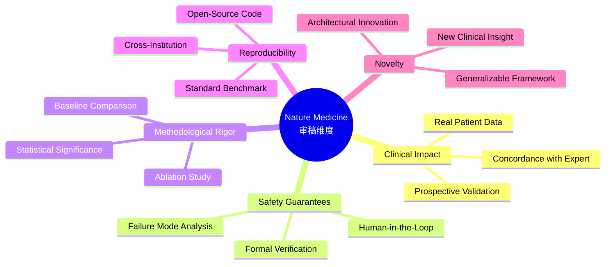
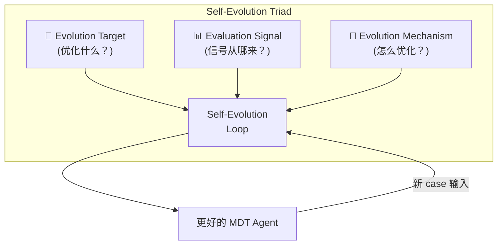
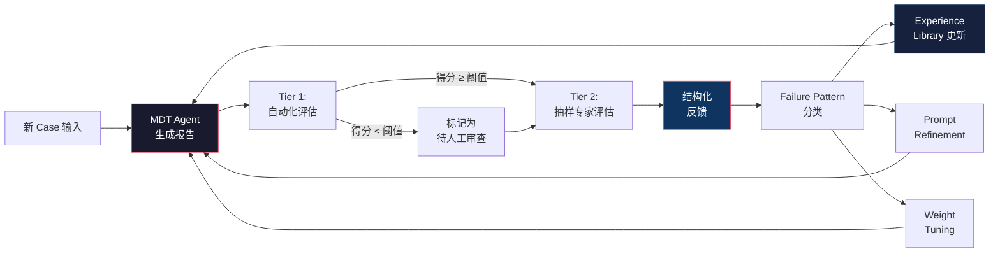
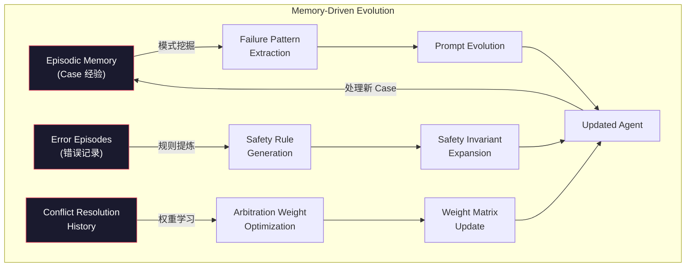

# TiantanBM Agent 差距分析 & 进化路线图

**时间**: 2026-04-26  
**定位**: 冲击 Nature Medicine / Cancer Cell 级别刊物的系统工程缺口分析  
**分析范围**: 研究范式 × 技术架构 × 自进化/记忆管理

---

## 目录

1. [当前系统能力快照](#1-当前系统能力快照)
2. [顶刊研究范式分析](#2-顶刊研究范式分析)
3. [研究思路层面差距 (8项)](#3-研究思路层面差距)
4. [技术架构层面差距 (7项)](#4-技术架构层面差距)
5. [自进化设计专题](#5-自进化设计专题--mdt-场景定制)
6. [记忆管理设计专题](#6-记忆管理设计专题)
7. [优先级路线图](#7-实施优先级路线图)

---

## 1. 当前系统能力快照

基于 [interactive_main.py](file:///Users/lucachangretta/Agent_Workspace/TiantanBM_Agent/interactive_main.py)、[orchestrator_prompt.py](file:///Users/lucachangretta/Agent_Workspace/TiantanBM_Agent/agents/orchestrator_prompt.py)、[auditor_prompt.py](file:///Users/lucachangretta/Agent_Workspace/TiantanBM_Agent/agents/auditor_prompt.py) 等核心文件分析：

| 模块 | 已具备 | 成熟度 |
|:-----|:-------|:------:|
| **Orchestra (分层调度)** | Orchestrator + 6 SubAgents, Zero-Execution Policy, EBM仲裁矩阵 | ★★★★☆ |
| **冲突协调** | 双权决策矩阵 (EBM_Level × Clinical_Priority), Module 5 冲突记录 | ★★★☆☆ |
| **证据溯源 (Auditor)** | 三重审计 (Physical + Support Consistency + EBM Level), EGR/SCR 指标 | ★★★★☆ |
| **PDF-Inspector (双模态)** | 文本→Markdown + 视觉重审计 (VLM), 双轨剂量验证 | ★★★★☆ |
| **OncoKB / PubMed Skills** | 实时分子证据查询 + 文献检索 | ★★★★☆ |
| **Pydantic 输出约束** | v6 Expert Schemas, 9-Module MDT Report Schema | ★★★★☆ |
| **自进化** | orchestrator_prompt.py L67-68 仅有 Evolution_Log 占位 | ★☆☆☆☆ |
| **记忆管理** | InMemoryStore (LangGraph), 文件级 Session Memory (sessions/{thread_id}.md) | ★★☆☆☆ |

> [!IMPORTANT]
> **核心判断**：你的系统在**冲突协调**和**证据溯源**两个临床痛点上已有不错的框架设计，但距离 Nature Medicine 级别还缺少**量化闭环验证**和**形式化保障**。需补强的主要方向是：不确定性量化、自进化闭环、多模态融合深度、以及面向审稿人的评估体系设计。

---

## 2. 顶刊研究范式分析

### 2.1 顶刊接受的 Medical Agent 论文范式

对 2024-2025 期间顶刊/顶会已发表的医疗 Agent 系统进行梳理：

| 工作 | 会议/期刊 | 核心创新 | 与你的关系 |
|:-----|:---------|:---------|:----------|
| **MDAgents** (Kim et al.) | NeurIPS 2024 | 自适应复杂度路由——简单case单Agent，复杂case动态组装MDT | 你的是固定MDT编队，缺少自适应路由 |
| **AgentHospital** (Tsinghua AIR) | arXiv 2024 | 虚拟医院仿真 + MedAgent-Zero自进化 | 你缺少 simulacrum 驱动的自进化 |
| **MDAT / Multi-Agent Consensus Matrix** | ASCO 2025 Poster | Kendall's W 共识量化 + 分歧可视化 | 你的仲裁是规则式，缺乏统计量化 |
| **MedGraphRAG** | arXiv 2024 | 知识图谱增强的 RAG，实体-关系层级溯源 | 你的 RAG 是扁平文本检索 |
| **MedReflect** | arXiv 2025 | 类医生反思思维模式，低成本反思数据集构建 | 你的 Agent 无显式反思环 |
| **ReflecTool** | arXiv 2024 | 反思感知的工具增强临床Agent | 你的工具调用无反思学习 |
| **EvoMDT** | MLHC 2025 | MDT 自进化回路：动态 prompt 优化 + 共识权重更新 | 你仅有 Evolution_Log 占位 |

### 2.2 Nature Medicine 审稿关注的五大维度



---

## 3. 研究思路层面差距

### Gap 1: 缺乏「自适应复杂度路由」叙事

> [!WARNING]
> MDAgents (NeurIPS 2024) 的核心贡献是：不是所有病例都需要全员MDT，简单case由单Agent处理，复杂case才动态召集MDT。

**你的现状**：所有病例都走完整6-Agent流水线  
**差距**：
- 无法展示「资源效率」vs「决策质量」的 trade-off 曲线
- 审稿人会问："为什么每个病例都需要分子病理 Agent？肺腺癌3cm单发脑转移真的需要完整MDT吗？"

**建议**：引入 **Triage Gate**——在 Orchestrator 前增加一个轻量级分诊器，根据病例复杂度 (DS-GPA评分 + 病灶数 + 原发灶状态) 动态决定召集哪些 SubAgent。这本身就是一个很好的消融实验维度。

---

### Gap 2: 冲突协调的「量化」缺失

**你的现状**：仲裁算法是 `EBM_Level_Score × Clinical_Priority_Weight`，输出确定性决策  
**差距**：
- **无共识度度量**：审稿人期望看到 Kendall's W 或 Fleiss' κ 等统计量来量化 Agent 间的一致性
- **无冲突分类学**：冲突类型（剂量分歧 vs 治疗模态分歧 vs 时序分歧）没有定义
- **无冲突热力图**：缺少可视化哪些类型的病例产生了哪些类型的冲突

**建议**：
1. 定义 **Conflict Taxonomy**：{Dose Conflict, Modality Conflict, Sequencing Conflict, Evidence Level Conflict}
2. 实现 **Agreement Matrix**：每个 SubAgent 对关键决策点（手术Y/N、SRS/WBRT、靶向/化疗）输出偏好向量 → 计算成对 Agent 间的 Cohen's κ
3. 产出 **Conflict Heatmap**：N_patients × M_conflict_types → 展示系统在哪些case上最容易分歧

---

### Gap 3: Ground Truth 设计 & 评估框架不完整

**你的现状**：`analysis/` 目录有10例测试方案 + 批量结果 + 可视化脚本  
**但缺少**：
- **Scoring Rubric (评分量表)**：Nature Medicine 级别的评估需要 **结构化专家评分**，而非简单 concordance rate
- **双盲设计**：专家评估时是否盲法？是否有 Agent 输出 vs 人类MDT 输出的随机配对？
- **Inter-rater Reliability**：多专家评估间的一致性报告 (ICC / Krippendorff's α)

**建议评估框架**：

```
┌─────────────────────────────────────────────────────┐
│         TiantanBM评估框架 (Multi-tier)               │
├─────────────────────────────────────────────────────┤
│                                                       │
│  Tier 1: 自动化指标 (无需人类)                         │
│    ├── EGR (Evidence Grounding Rate) ← 已有           │
│    ├── SCR (Support Consistency Rate) ← 已有          │
│    ├── PTR (Physical Traceability Rate)               │
│    ├── Conflict Resolution Rate                       │
│    ├── Guideline Adherence Score                      │
│    └── Latency & Token Cost                          │
│                                                       │
│  Tier 2: 专家评估 (3-5名专家, 结构化评分)              │
│    ├── Clinical Correctness (5-point Likert)          │
│    ├── Evidence Quality (1-5)                         │
│    ├── Treatment Completeness (1-5)                   │
│    ├── Safety: 是否有致命性错误 (Binary)               │
│    ├── Actionability: 报告能否直接指导临床 (1-5)       │
│    └── Inter-rater reliability: Krippendorff's α      │
│                                                       │
│  Tier 3: 头对头比较                                    │
│    ├── Agent MDT Report vs 真实MDT会议记录             │
│    ├── Agent Report vs 单Agent (GPT-4/Claude) 基线    │
│    ├── Agent Report vs RAG-only 基线                  │
│    └── Agent Report vs 单科专家意见                    │
│                                                       │
│  Tier 4: 消融实验                                      │
│    ├── w/o Auditor → EGR/SCR 下降幅度                 │
│    ├── w/o Dual-Track → 剂量错误率变化                 │
│    ├── w/o Conflict Arbitration → 安全事件率            │
│    ├── w/o Self-Evolution → 长期性能退化曲线            │
│    └── 不同SubAgent组合的效果                          │
└─────────────────────────────────────────────────────┘
```

---

### Gap 4: 缺乏 「不确定性量化 (UQ)」 叙事

> [!NOTE]
> 你当前打开的文件就是关于 LLM Agent UQ 的综述——这正是你系统最大的盲区之一。

**你的现状**：Agent 输出确定性建议，没有置信度或不确定性标注  
**审稿人会问**：
- "Agent 说推荐 SRS 18Gy，它有多确定？如果证据只有 Level 3，系统如何表达不确定性？"
- "当 SubAgent 之间分歧严重时，最终仲裁的置信度是多少？"

**建议**：
1. **Claim-Level Confidence**：每条 ClinicalClaim 增加 `confidence_score: float` 字段，由以下因素计算：
   - 证据等级权重 (Level 1=1.0, Level 2=0.7, Level 3=0.4, Level 4=0.2)
   - 支撑源数量 (多源交叉验证 → 置信提升)
   - Agent 间一致性 (所有Agent都推荐 → 高置信)
2. **Decision-Level Uncertainty**：最终报告包含一个 `confidence_band: {high, moderate, low, insufficient_evidence}`
3. **Epistemic vs Aleatoric**：区分「证据不足的不确定性」与「病例本身的歧义性」

---

### Gap 5: 缺少「安全性形式化保障」

**你的现状**：安全机制是规则硬编码 (submit_mdt_report 的审计拦截, ALLOWED_PREFIXES 白名单)  
**差距**：
- 缺少 **Safety Invariant** 的形式化定义
- 缺少 **Failure Mode Taxonomy**：哪些失败模式已被覆盖？哪些未覆盖？
- 缺少 **红队攻击测试 (Red-Teaming)**

**建议**：
1. 定义 10 条 **Safety Invariants**（如："禁止对 KRAS 突变 CRC 推荐抗 EGFR 单抗"、"WBRT 剂量不得超过 40Gy/20f"）
2. 构建 **Adversarial Test Suite**：故意注入矛盾信息或极端case，验证系统是否能安全拒答
3. 这是与安全/可信 AI 叙事的交叉创新点

---

### Gap 6: Baseline 对比不充分

**你的现状**：有4种方法的可视化对比 ([generate_four_methods_visualization.py](file:///Users/lucachangretta/Agent_Workspace/TiantanBM_Agent/analysis/generate_four_methods_visualization.py))  
**还需要**：
- **Vanilla LLM baseline** (单次 GPT-4o/Claude 调用)
- **RAG-only baseline** (检索指南 + 单次生成，无 Agent 编排)
- **Round-Robin MDT** (多 Agent 轮流发言，无 Orchestrator 仲裁)
- **Human MDT** (真实会诊记录)
- **Ablation variants** (w/o Auditor, w/o Dual-Track, w/o specific SubAgents)

---

### Gap 7: 可重复性与泛化性陈述

**审稿人会质疑**：
- "这个系统只在天坛的脑转移上测试过，能泛化到其他癌种吗？"
- "换一个LLM backbone会怎样？"

**建议**：
1. 至少展示**一个cross-institution验证**（哪怕是公开数据集）
2. 展示**backbone ablation**：qwen3.6-plus vs GPT-4o vs Claude Opus
3. 展示**跨癌种泛化**的初步结果（哪怕只是2-3个case的proof-of-concept）

---

### Gap 8: 论文叙事缺乏「临床工作流嵌入」视角

**顶刊非常看重**：你的系统如何融入现有临床工作流？

- 不只是"AI生成了报告"，而是"AI在MDT会前15分钟内生成草案，医生review后修改了X处"
- **Human-AI Interaction Study**：记录医生使用系统的行为数据（阅读时间、修改比例、采纳率）

---

## 4. 技术架构层面差距

### TechGap 1: 知识图谱层缺失

**现状**：证据检索是扁平的 (grep指南文本 / PubMed关键词 / OncoKB API)  
**缺失**：
- 无**医学知识图谱 (Medical KG)**：无法进行 Drug → Target → Pathway → Resistance 的链式推理
- 无法自动发现「药物A耐药后，根据耐药机制推荐药物B」的逻辑链

**建议架构**：

```
┌──────────────────────────────────────────────┐
│              Evidence Retrieval Layer          │
│                                                │
│  ┌──────────┐  ┌──────────┐  ┌──────────┐    │
│  │ Text RAG │  │ OncoKB   │  │ PubMed   │    │
│  │ (BM25 +  │  │ API      │  │ Search   │    │
│  │  Dense)  │  │          │  │          │    │ ← 你已有
│  └────┬─────┘  └────┬─────┘  └────┬─────┘    │
│       │              │              │          │
│       └──────────────┴──────────────┘          │
│                      │                         │
│                      ▼                         │
│  ┌──────────────────────────────────────┐     │
│  │      Medical Knowledge Graph         │     │ ← 你缺少
│  │  (Drug↔Target↔Pathway↔Resistance)    │     │
│  │  + Temporal Reasoning (治疗序列)      │     │
│  └──────────────────────────────────────┘     │
│                      │                         │
│                      ▼                         │
│  ┌──────────────────────────────────────┐     │
│  │      Graph-Enhanced RAG              │     │ ← 你缺少
│  │  (Subgraph extraction → Context)     │     │
│  └──────────────────────────────────────┘     │
└──────────────────────────────────────────────┘
```

---

### TechGap 2: Memory Architecture 过于原始

**现状**：`InMemoryStore` (LangGraph) + 文件级 session md  
**问题**：
- 当前 memory 是**会话级别**的，无跨会话持久化
- 无**语义索引**——无法按疾病类型、药物名、突变类型检索历史case
- SubAgent 间的共享 memory 通过文件系统（`cat /memories/sessions/{thread_id}.md`），容易丢失且不可搜索

→ 详见 [§6 记忆管理设计专题](#6-记忆管理设计专题)

---

### TechGap 3: 缺少 Structured Output Validation Pipeline

**现状**：Pydantic Schema 定义了输出结构 ([v6_expert_schemas.py](file:///Users/lucachangretta/Agent_Workspace/TiantanBM_Agent/schemas/v6_expert_schemas.py))，但  
**缺失**：
- 无**语义约束验证**：Pydantic 只验证类型，不验证语义一致性
  - 例：`surgical_urgency: "emergency"` 但 `midline_shift: false` → 逻辑矛盾
- 无**跨 SubAgent 一致性检查**：
  - 影像 Agent 说 `lesion_count: 1`，但内科 Agent 说"多发脑转移"
- 建议增加 **Cross-Agent Consistency Validator** 层

---

### TechGap 4: 多模态融合深度不足

**现状**：VLM 仅用于剂量表格的视觉重审计  
**可扩展**：
- **影像 AI 集成**：接入脑MRI分割模型，自动提取病灶数量/体积/位置
- **病理 WSI 分析**：如果有数字病理切片，可接入病理AI模型
- **基因组数据**：VCF 文件的自动化解读（你的 `MedicalDataType` 已有 `vcf_genomic_data` 预留但未实现）

---

### TechGap 5: SubAgent 通信缺乏结构化协议

**现状**：Orchestrator 通过 `task()` 委派，SubAgent 返回 JSON  
**缺失**：
- 无**显式的 Query/Challenge Protocol**：Agent A 无法主动质疑 Agent B 的结论
- 无**Multi-Round Debate**：所有交互都是 Orchestrator 中转的，SubAgent之间不直接对话
- **建议**：实现 Structured Debate Protocol——当冲突检测到时，让冲突双方进行1-2轮结构化辩论（含引用），Orchestrator 作为裁判

---

### TechGap 6: 执行可观测性 (Observability) 不够深

**现状**：有 `ExecutionLogger` + audit_log + subagent_full_logging  
**还需要**：
- **Token 消耗追踪**：每个 SubAgent、每个 Skill 的 token cost 细分
- **Latency Breakdown**：端到端延迟的瀑布图（哪个环节最慢）
- **Decision Lineage Graph**：「为什么最终推荐了 SRS」→ 追溯到哪个 Agent 贡献了关键证据

---

### TechGap 7: 指南版本管理与更新机制

**现状**：指南以 PDF/MD 静态存储于 `Guidelines/` 目录  
**缺失**：
- 无**版本比对**：NCCN 2025 v2 vs v1 的差异自动发现
- 无**增量更新推送**：当新版指南发布时，自动触发关键知识点的更新
- 这对「系统持续可信」至关重要，也是自进化的基础设施

---

## 5. 自进化设计专题 — MDT 场景定制

> [!IMPORTANT]
> 自进化 (Self-Evolution) 的核心问题是：**谁来做 Judge？信号从哪来？优化什么？**
> 在你们的 MDT 场景中，Ground Truth 不是标准答案，而是**专家共识的上界**。

### 5.1 自进化的三要素



### 5.2 Evolution Target — 在 MDT 场景中优化什么？

| 进化目标 | 描述 | 适合你的场景 |
|:---------|:-----|:----------:|
| **Prompt Evolution** | 优化各 SubAgent 的 system prompt | ✅ 最直接 |
| **Retrieval Strategy** | 优化检索关键词模板和指南检索路径 | ✅ 高价值 |
| **Arbitration Weights** | 优化冲突仲裁的权重矩阵 | ✅ 核心创新点 |
| **Skill Selection** | 优化何时调用哪个 Skill | ✅ 与 Triage Gate 配合 |
| **Agent Ensemble** | 优化 SubAgent 的组合和召集策略 | ✅ MDAgents 式路由 |
| **Safety Invariants** | 从错误Case中自动提取新的安全规则 | ⚠️ 需谨慎 |

### 5.3 Evaluation Signal — MDT场景中信号从哪来？

这是你的核心困惑，我给出三条可行路径：

#### Signal Source 1: 多专家离线评估 (Primary, 最可信)

```
Case N → Agent 生成 MDT Report → 脱敏 → 3-5 名专家独立评分
                                          ↓
                                  结构化评分量表 (8 维度)
                                          ↓
                                  Aggregated Score → 反馈给进化模块
```

**关键设计**：
- **评分量表 (Rubric)**：8 个维度，每维度 1-5 分
  1. 治疗方案的临床正确性
  2. 证据引用的准确性和充分性
  3. 治疗线判定的合理性
  4. 冲突解决的逻辑性
  5. 围手术期管理的完整性
  6. 分子检测建议的合理性
  7. 随访方案的科学性
  8. 报告的可操作性 (Actionability)
- **评估频率**：每积累 20-30 个 case 进行一次批量专家评估
- **可行性**：这完全可以作为论文中的 Human Evaluation Protocol

#### Signal Source 2: 自动化代理评估 (Secondary, 大规模)

```
Case N → Agent Report → Auto-Eval Pipeline:
  ├── Guideline Adherence Checker (规则)
  ├── Citation Verification (你的 Auditor)
  ├── Cross-Agent Consistency Check (新增)
  ├── Safety Invariant Checker (新增)
  └── LLM-as-Judge (GPT-4o 评分, 用你的 Rubric)
                     ↓
              Composite Score → 反馈给进化模块
```

**关键**：LLM-as-Judge 要使用与你的 backbone 不同的模型（避免自我评价偏差）。

#### Signal Source 3: 结构化临床反馈 (Tertiary, 产品化时)

```
Agent Report → 临床实际使用 → 医生反馈:
  ├── 修改了哪些推荐？（打标记）
  ├── 采纳率 (Adoption Rate)
  ├── 是否触发了安全事件？
  └── 与最终真实诊疗方案的偏差
```

### 5.4 Evolution Mechanism — 具体怎么进化？

#### Mechanism 1: Prompt Refinement Loop

```python
# 伪代码：Prompt 自进化循环
def evolve_prompts(agent_name, failed_cases, expert_feedback):
    """
    从失败案例和专家反馈中提取 prompt 优化指令
    """
    # 1. 收集失败模式
    failure_patterns = classify_failures(failed_cases)
    # e.g., {"dose_error": 3, "wrong_treatment_line": 2, "missing_ddi": 1}
    
    # 2. 生成 Prompt Patch
    for pattern, count in failure_patterns.items():
        patch = generate_prompt_patch(
            current_prompt=load_prompt(agent_name),
            failure_type=pattern,
            example_cases=failed_cases[pattern],
            expert_comments=expert_feedback[pattern]
        )
        # 3. A/B Test: 在 held-out cases 上比较新旧 prompt
        old_score = evaluate(current_prompt, test_cases)
        new_score = evaluate(patched_prompt, test_cases)
        
        if new_score > old_score + margin:
            apply_patch(agent_name, patch)
            log_evolution(agent_name, pattern, old_score, new_score)
```

#### Mechanism 2: Experience Library (经验库，与 ExpeL 类似)

```
┌─────────────────────────────────────────────────┐
│              Experience Library                   │
├─────────────────────────────────────────────────┤
│                                                   │
│  ┌───────────────────────────────────────┐       │
│  │  Success Trajectories (成功轨迹)      │       │
│  │  ├── Case: EGFR 19del, 单发 3cm BM   │       │
│  │  │   → 正确路径: OncoKB → Osimertinib │       │
│  │  │   → Score: 4.8/5.0                 │       │
│  │  │   → Key Insight: "先查 T790M"     │       │
│  │  └── ...                              │       │
│  └───────────────────────────────────────┘       │
│                                                   │
│  ┌───────────────────────────────────────┐       │
│  │  Failure Patterns (失败模式)           │       │
│  │  ├── Pattern: "剂量从预训练记忆提取"   │       │
│  │  │   → 触发条件: 未调用 cns_drug_db    │       │
│  │  │   → 修正规则: 强制 Skill 调用       │       │
│  │  └── ...                              │       │
│  └───────────────────────────────────────┘       │
│                                                   │
│  ┌───────────────────────────────────────┐       │
│  │  Distilled Insights (提炼洞察)         │       │
│  │  ├── "KRAS CRC: 永远检查 G12C 状态"   │       │
│  │  ├── "HER2+ BM: 优先考虑 Tucatinib"  │       │
│  │  └── ...                              │       │
│  └───────────────────────────────────────┘       │
│                                                   │
│  索引方式: 癌种 × 突变类型 × 治疗线 × 病灶特征    │
└─────────────────────────────────────────────────┘
```

#### Mechanism 3: Arbitration Weight Tuning

```python
# 当前的固定权重
WEIGHTS = {
    "Level_1_RCT": 100,     # 固定
    "Level_2_Cohort": 70,    # 固定
    "Life_saving": 5.0,      # 固定
    "Diagnostic": 3.0,       # 固定
    ...
}

# 进化后的自适应权重
class AdaptiveArbitrationWeights:
    def __init__(self):
        self.base_weights = WEIGHTS.copy()
        self.adjustment_log = []
    
    def update_from_feedback(self, case_id, expert_verdict, agent_decision):
        """当专家否决了 Agent 的仲裁结果时，分析权重偏差"""
        if expert_verdict != agent_decision:
            # 分析哪个权重导致了错误决策
            contributing_factor = analyze_decision_path(case_id)
            # 微调权重 (带阻尼系数，防止过拟合单个case)
            self.base_weights[contributing_factor] *= 0.95  # 缓慢衰减
            self.adjustment_log.append({
                "case_id": case_id,
                "factor": contributing_factor,
                "direction": "decrease",
                "new_value": self.base_weights[contributing_factor]
            })
```

### 5.5 端到端自进化闭环



---

## 6. 记忆管理设计专题

### 6.1 为什么当前的 Memory 设计不够？

你当前的 Memory：
1. **InMemoryStore**：进程结束即销毁
2. **sessions/{thread_id}.md**：文件级追加，无索引，无语义搜索

**医学场景特有的 Memory 需求**：
- **Case-to-Case 学习**：处理第 50 个 EGFR 脑转移时，应该能回忆第 1-49 个的经验
- **指南更新记忆**：NCCN 2025 v3 更新了某个推荐后，Memory 应自动标记旧知识为 stale
- **错误记忆**：记住自己犯过的错误，避免重复

### 6.2 三层记忆架构设计

```
┌─────────────────────────────────────────────────────────────┐
│                    Memory Architecture                        │
├─────────────────────────────────────────────────────────────┤
│                                                               │
│  Layer 1: Working Memory (工作记忆, 单次会话)                  │
│  ├── 当前患者信息                                             │
│  ├── 当前各 SubAgent 输出                                     │
│  ├── 当前审计结果                                             │
│  └── 实现: SkillContext (你已有)                              │
│                                                               │
│  Layer 2: Episodic Memory (情节记忆, 跨会话)                   │
│  ├── Case Embeddings: 每个处理过的case的向量化摘要              │
│  ├── Decision Trajectories: 关键决策路径的结构化记录           │
│  ├── Error Episodes: 被专家纠正的案例及修正原因                │
│  ├── Conflict Resolution Episodes: 冲突解决的完整过程          │
│  └── 实现: SQLite FTS5 + 向量索引 (FAISS/ChromaDB)           │
│                                                               │
│  Layer 3: Semantic Memory (语义记忆, 持久化知识)               │
│  ├── Distilled Rules: 从经验中提炼的规则                      │
│  │   (如 "EGFR 19del + BM → 奥希替尼优先于一代TKI")          │
│  ├── Performance Statistics: 各癌种/场景的历史表现             │
│  ├── Guideline Changelog: 指南更新的 diff 记录                │
│  └── 实现: Structured JSON + KG Triples                      │
│                                                               │
└─────────────────────────────────────────────────────────────┘
```

### 6.3 Memory 的读写时机

| 时机 | 读 (Recall) | 写 (Consolidate) |
|:-----|:------------|:-----------------|
| **Case 开始时** | 检索 Layer 2 中相似case (按癌种+突变+BM特征) → 注入 Orchestrator context | — |
| **SubAgent 执行时** | 检索 Layer 3 中该癌种的 distilled rules → 注入 SubAgent context | — |
| **冲突检测时** | 检索 Layer 2 中类似冲突的历史解决方案 | — |
| **Case 完成后** | — | Case summary → Layer 2 Episodic Memory |
| **专家反馈后** | — | Feedback → Layer 2 Error Episodes; Distilled insights → Layer 3 |
| **指南更新时** | — | Diff → Layer 3 Guideline Changelog; 标记相关 rules 为 stale |

### 6.4 关键实现：相似 Case 检索

```python
class EpisodicMemory:
    """情节记忆——支持语义检索的Case数据库"""
    
    def retrieve_similar_cases(self, current_case: PatientProfile, top_k: int = 3):
        """
        检索与当前Case最相似的历史Case
        
        相似度 = 加权组合:
          - 癌种匹配 (exact match, weight=0.3)
          - 突变匹配 (semantic sim, weight=0.3) 
          - 病灶特征 (count, size, location cosine sim, weight=0.2)
          - 治疗线 (exact, weight=0.2)
        """
        candidates = self.db.query(
            cancer_type=current_case.primary_tumor,
            mutation=current_case.mutations
        )
        
        scored = []
        for case in candidates:
            sim = (
                0.3 * cancer_type_match(current_case, case) +
                0.3 * mutation_similarity(current_case, case) +
                0.2 * lesion_feature_sim(current_case, case) +
                0.2 * treatment_line_match(current_case, case)
            )
            scored.append((case, sim))
        
        return sorted(scored, key=lambda x: -x[1])[:top_k]
    
    def inject_into_context(self, similar_cases, agent_name: str) -> str:
        """将检索到的历史Case注入Agent上下文"""
        context = "## 历史相似Case参考\n\n"
        for case, sim in similar_cases:
            context += f"### Case {case.id} (相似度: {sim:.2f})\n"
            context += f"- 诊断: {case.diagnosis}\n"
            context += f"- 最终方案: {case.final_plan}\n"
            if case.expert_feedback:
                context += f"- ⚠️ 专家修正: {case.expert_feedback}\n"
            context += "\n"
        return context
```

### 6.5 Memory 与自进化的关系



> [!TIP]
> **Memory 是自进化的基础设施**——没有结构化的记忆存储，就无法进行跨 Case 的模式提取和规则提炼。因此，Memory 建设应优先于自进化模块的实现。

---

## 7. 实施优先级路线图

### Phase 1: 评估体系补齐 (2-3 周) — 论文投稿前必须

| 任务 | 优先级 | 预期产出 |
|:-----|:------:|:---------|
| 设计结构化专家评分量表 (Rubric) | P0 | 论文 Methods 核心 |
| 实现 Conflict Taxonomy + Agreement Matrix | P0 | Table/Figure 素材 |
| 补齐 Baseline 对比 (Vanilla LLM, RAG-only) | P0 | 论文 Results 核心 |
| 消融实验设计 (w/o Auditor, w/o Dual-Track) | P0 | 论文 Ablation |
| 不确定性置信度标注 (Claim-level confidence) | P1 | 增强可信度叙事 |

### Phase 2: Memory 架构 (3-4 周) — 自进化的前置条件

| 任务 | 优先级 | 预期产出 |
|:-----|:------:|:---------|
| 实现 Episodic Memory (SQLite FTS5) | P0 | 跨 Case 学习基础 |
| 实现相似 Case 检索 + Context Injection | P0 | Agent 性能提升 |
| Error Episode 结构化记录 | P1 | 自进化信号源 |
| Guideline Changelog 管理 | P1 | 知识时效性保障 |

### Phase 3: 自进化闭环 (4-6 周) — 论文核心创新点

| 任务 | 优先级 | 预期产出 |
|:-----|:------:|:---------|
| 自动化评估管线 (Tier 1 Auto-Eval) | P0 | 大规模进化信号 |
| Prompt Refinement Loop MVP | P0 | 进化机制1 |
| Experience Library 构建 | P1 | 进化机制2 |
| Arbitration Weight Tuning | P1 | 进化机制3 |
| A/B Test Framework | P1 | 进化效果验证 |

### Phase 4: 高级特性 (按需)

| 任务 | 优先级 | 预期产出 |
|:-----|:------:|:---------|
| Triage Gate (自适应路由) | P1 | MDAgents 式创新 |
| Knowledge Graph 集成 | P2 | MedGraphRAG 式增强 |
| Red-Team Testing Suite | P2 | 安全性叙事 |
| Cross-Institution Validation | P2 | 泛化性证据 |
| Structured Debate Protocol | P2 | 冲突解决深度提升 |

---

> [!NOTE]
> **最终建议**：你的系统核心架构（分层MDT + 证据审计 + 双轨验证）已经具备了不错的工程完成度。距离顶刊最大的差距不在代码，而在**评估体系的严谨性**和**进化闭环的创新叙事**。建议将论文 Story 的核心锚定为：
>
> **"From Static Expert Rules to Self-Evolving MDT: A Memory-Augmented Multi-Agent Framework with Verifiable Evidence Grounding for Brain Metastasis Management"**
>
> 这个叙事同时覆盖了：冲突协调 (existing)、证据溯源 (existing)、自进化 (new)、记忆管理 (new)——形成一个完整的贡献链。
