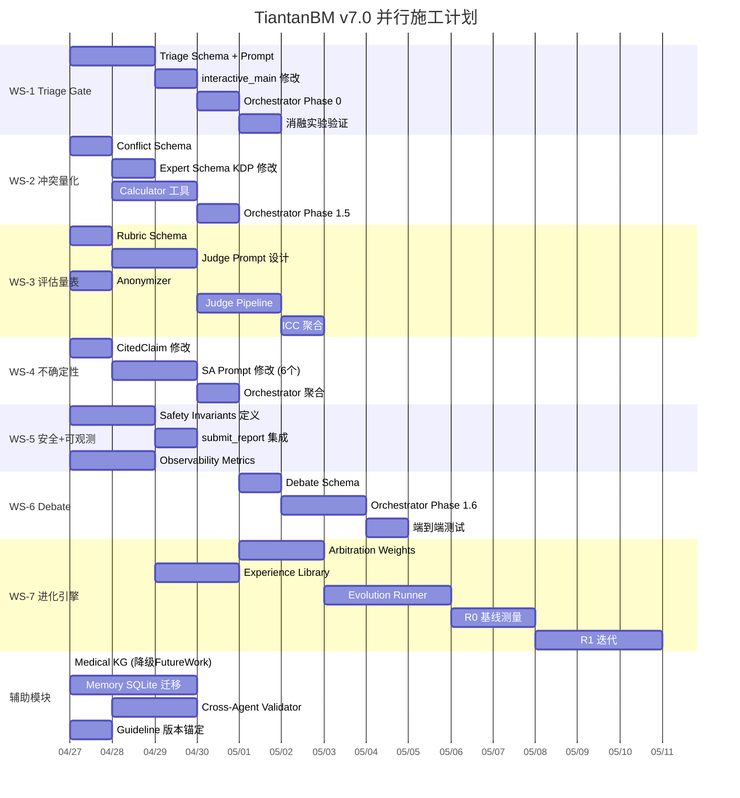

# TiantanBM Agent v7.0 — 技术实施方案

**版本**: v1.1 FINAL  
**时间**: 2026-04-26  
**目标**: 可直接分发给多个 Agent 并行施工的确定性方案，零歧义  
**架构基座**: Deep Agents 0.5.3 (LangGraph)  
**当前 SubAgent 矩阵**: imaging-specialist, primary-oncology-specialist, neurosurgery-specialist, radiation-oncology-specialist, molecular-pathology-specialist, evidence-auditor (共6个)

---

## 目录

- [总体架构升级蓝图](#总体架构升级蓝图)
- [WS-1: Triage Gate (自适应复杂度路由)](#ws-1-triage-gate-自适应复杂度路由)
- [WS-2: 冲突量化与统计仲裁](#ws-2-冲突量化与统计仲裁)
- [WS-3: 结构化专家评估量表 & LLM-as-Judge](#ws-3-结构化专家评估量表--llm-as-judge)
- [WS-4: 不确定性量化](#ws-4-不确定性量化)
- [WS-5: 安全不变量 & 可观测性](#ws-5-安全不变量--可观测性)
- [WS-6: SubAgent 间结构化辩论](#ws-6-subagent-间结构化辩论)
- [WS-7: 自进化引擎](#ws-7-自进化引擎)
- [辅助模块: Medical KG 集成策略](#辅助模块-medical-kg-集成策略)
- [辅助模块: Memory 架构迁移](#辅助模块-memory-架构迁移)
- [辅助模块: Cross-Agent Consistency Validator](#辅助模块-cross-agent-consistency-validator)
- [辅助模块: 指南版本锚定](#辅助模块-指南版本锚定)
- [WS 依赖关系 & 并行施工图](#ws-依赖关系--并行施工图)

---

## 总体架构升级蓝图

```
v6.0 (当前)                              v7.0 (目标)
┌──────────────┐                    ┌──────────────────────┐
│ User Input   │                    │ User Input           │
└──────┬───────┘                    └──────┬───────────────┘
       │                                   │
       ▼                                   ▼
┌──────────────┐                    ┌──────────────────────┐
│ Orchestrator │                    │ Triage Gate          │ ← WS-1 新增
│ (固定6SA)    │                    │ (复杂度分类 → 路由)   │
└──────┬───────┘                    └──────┬───────────────┘
       │                                   │
       ▼                                   ▼
┌──────────────┐                    ┌──────────────────────┐
│ 6 SubAgents  │                    │ Orchestrator v7      │
│ (并行/串行)  │                    │ ├── 动态SA编排        │ ← WS-1
└──────┬───────┘                    │ ├── 冲突量化(κ/W)    │ ← WS-2
       │                            │ ├── 辩论调度         │ ← WS-6
       ▼                            │ └── 置信度聚合       │ ← WS-4
┌──────────────┐                    └──────┬───────────────┘
│ Auditor      │                           │
│ (三重审计)   │                           ▼
└──────┬───────┘                    ┌──────────────────────┐
       │                            │ N SubAgents (动态)    │
       ▼                            │ ├── 置信度输出        │ ← WS-4
┌──────────────┐                    │ ├── 结构化辩论        │ ← WS-6
│ Report       │                    │ └── Safety Guard      │ ← WS-5
│ Submit       │                    └──────┬───────────────┘
└──────────────┘                           │
                                           ▼
                                    ┌──────────────────────┐
                                    │ Cross-Agent Validator │ ← 新增
                                    │ + Auditor v7          │
                                    └──────┬───────────────┘
                                           │
                                           ▼
                                    ┌──────────────────────┐
                                    │ Evolution Engine      │ ← WS-7
                                    │ + Memory Layer        │
                                    └──────────────────────┘
```

---

## WS-1: Triage Gate (自适应复杂度路由)

### 目标
在 Orchestrator 前增加轻量级分诊器，根据病例复杂度动态决定召集哪些 SubAgent，而非固定6个全部调用。

### 修改文件清单

| 文件 | 修改类型 | 说明 |
|:-----|:--------:|:-----|
| `agents/triage_prompt.py` | **新建** | Triage Agent 的 system prompt |
| `schemas/triage_schema.py` | **新建** | Triage 输出 schema |
| `interactive_main.py` | **修改** | 注册 triage-gate 为新的 SubAgent |
| `agents/orchestrator_prompt.py` | **修改** | 增加基于 Triage 输出的动态编排逻辑 |
| `config.py` | **修改** | 增加 TRIAGE_MODEL_NAME 配置 |

### 1.1 新建 `schemas/triage_schema.py`

```python
"""
schemas/triage_schema.py
v7.0 — Triage Gate 输出 Schema
"""
from typing import List, Literal
from pydantic import BaseModel, Field


class TriageOutput(BaseModel):
    """分诊门输出：决定病例复杂度和需要召集的SubAgent"""

    complexity_level: Literal["simple", "moderate", "complex"] = Field(
        description=(
            "simple: 单发小病灶、已知原发灶、明确靶点 → 3个核心SA; "
            "moderate: 多发病灶或复杂分子背景 → 5个SA; "
            "complex: 危及生命/原发不明/多线失败 → 全部6个SA + Debate"
        )
    )

    required_subagents: List[Literal[
        "imaging-specialist",
        "primary-oncology-specialist",
        "neurosurgery-specialist",
        "radiation-oncology-specialist",
        "molecular-pathology-specialist",
        "evidence-auditor"
    ]] = Field(description="本次需要召集的SubAgent列表")

    triage_rationale: str = Field(
        description="分诊理由，100字以内"
    )

    # 关键临床指标提取（供 Orchestrator 快速决策）
    estimated_lesion_count: int = Field(description="估计病灶数量")
    midline_shift_suspected: bool = Field(description="是否疑似中线移位")
    primary_known: bool = Field(description="原发灶是否已知")
    treatment_line: int = Field(description="估计当前治疗线数(0=初治)")
    emergency_flag: bool = Field(description="是否需要急诊处理")
```

### 1.2 新建 `agents/triage_prompt.py`

```python
"""
agents/triage_prompt.py
v7.0 — Triage Gate System Prompt
"""

TRIAGE_SYSTEM_PROMPT = """你是天坛脑转移 MDT 的**分诊门 (Triage Gate)**。

### 职责
你的唯一任务是快速分析患者信息，判定病例复杂度，并决定需要召集哪些专科SubAgent。

### 分诊规则

#### Complexity = "simple" (召集3个SA)
满足以下**全部**条件：
- 单发脑转移（≤1个病灶）
- 病灶 ≤ 3cm
- 原发灶已知且有明确靶点
- 初治或一线治疗

→ 召集: imaging-specialist, primary-oncology-specialist, radiation-oncology-specialist
→ 跳过: neurosurgery-specialist, molecular-pathology-specialist

#### Complexity = "moderate" (召集5个SA)
满足以下**任一**条件：
- 2-4个病灶
- 二线及以上治疗
- 原发灶已知但靶点不明

→ 召集: 全部5个专科SA (不含 evidence-auditor, auditor 由 Orchestrator 固定调用)

#### Complexity = "complex" (召集全部6个SA + 激活Debate)
满足以下**任一**条件：
- 病灶 ≥ 5个
- 中线移位或脑疝风险
- 原发灶未知
- 三线及以上治疗失败
- KPS ≤ 50

→ 召集: 全部6个SA + 告知 Orchestrator 激活 Structured Debate

### 注意
- evidence-auditor 始终由 Orchestrator 在 Phase 2 自动调用，不在你的分诊范围内
- 你严禁进行任何临床推理，只做分诊分类
- 输出必须是 TriageOutput JSON
"""
```

### 1.3 修改 `interactive_main.py`

在 SubAgent 定义区域 (L655-732) 后新增：

```python
# =============================================================================
# v7.0 Triage Gate SubAgent
# =============================================================================
from agents.triage_prompt import TRIAGE_SYSTEM_PROMPT
from schemas.triage_schema import TriageOutput

triage_sa = {
    "name": "triage-gate",
    "description": (
        "Lightweight triage agent that classifies case complexity "
        "and determines which specialist SubAgents to invoke. "
        "MUST be called FIRST before any specialist delegation."
    ),
    "system_prompt": TRIAGE_SYSTEM_PROMPT,
    "tools": [read_file],  # 只需读取患者文件，不需要 execute
    "response_format": TriageOutput,
    "model": SUBAGENT_MODEL_NAME,
}
```

在 `agent = create_deep_agent(...)` 调用中的 `subagents` 列表最前面插入 `triage_sa`：

```python
subagents=[
    triage_sa,          # v7.0: Triage Gate (FIRST)
    imaging_sa,
    primary_oncology_sa,
    neurosurgery_sa,
    radiation_sa,
    molecular_pathology_sa,
    evidence_auditor_sa,
],
```

### 1.4 修改 `agents/orchestrator_prompt.py`

在 `### 工作流 (The MDT Workflow)` 的 Phase 1 前新增：

```
#### Phase 0: 分诊 (Triage - MANDATORY FIRST STEP)
1. 调用 `triage-gate`：传入完整患者信息。
2. 读取 TriageOutput JSON 中的 `required_subagents` 列表。
3. 后续 Phase 1 中，**只委派 `required_subagents` 中列出的 SubAgent**。
4. 如果 `complexity_level` == "complex"：在 Phase 2 冲突检测时激活 Structured Debate Protocol。
5. 如果 `emergency_flag` == true：立即优先委派 neurosurgery-specialist，不等待其他 SA。
```

### 1.5 消融实验支持

在 `config.py` 新增：

```python
# v7.0 Triage Gate 开关（用于消融实验）
TRIAGE_ENABLED = True  # False = 退回 v6 固定6SA模式
```

---

## WS-2: 冲突量化与统计仲裁

### 目标
让 Orchestrator 对 SubAgent 间的分歧进行统计量化，产出 Conflict Taxonomy + Agreement Matrix + Conflict Heatmap。

### 核心概念澄清

> **你的困惑**: "如果出现不一致，都来自 subagents，如何做统计量化？"
>
> **回答**: 统计量化的对象是**决策向量**。每个 SubAgent 在其输出 JSON 中会对若干**关键决策点 (Key Decision Points, KDP)** 表达偏好。Orchestrator 收集所有 SA 的偏好后，计算成对一致性。
>
> 例如：对于 KDP "局部治疗选择 (SRS vs WBRT vs Surgery)"：
> - imaging-specialist: 输出 `lesion_count: 1, max_diameter: 2.5` → 隐含偏好 SRS
> - neurosurgery: 输出 `surgical_goal: "none"` → 偏好非手术
> - radiation: 输出 `radiation_modality: "SRS"` → 明确偏好 SRS
> - primary-oncology: 输出 `local_therapy_opinion: "SRS preferred"` → 偏好 SRS
>
> → 这4个Agent在"局部治疗"这个KDP上的一致性 κ = 1.0 (完全一致)
>
> 如果 neurosurgery 输出了 `surgical_goal: "resection"` → κ < 1.0，触发冲突。
>
> **Orchestrator 完全可以在 Prompt 中被指示进行此计算**。

### 修改文件清单

| 文件 | 修改类型 | 说明 |
|:-----|:--------:|:-----|
| `schemas/conflict_schema.py` | **新建** | 冲突分类学 + Agreement Matrix schema |
| `schemas/v6_expert_schemas.py` | **修改** | 所有 SA 输出增加 KDP 偏好向量 |
| `agents/orchestrator_prompt.py` | **修改** | 增加冲突量化计算步骤 |
| `tools/conflict_calculator.py` | **新建** | Cohen's κ / Kendall's W 计算工具 |

### 2.1 新建 `schemas/conflict_schema.py`

```python
"""
schemas/conflict_schema.py
v7.0 — 冲突分类学与Agreement Matrix
"""
from typing import List, Dict, Optional, Literal
from pydantic import BaseModel, Field


class KeyDecisionPoint(BaseModel):
    """关键决策点"""
    kdp_id: str = Field(description="决策点标识, 如 'local_therapy', 'systemic_therapy', 'surgery_indication'")
    kdp_description: str
    options: List[str] = Field(description="该决策点的所有可能选项")


# 固定的 5 个 KDP
STANDARD_KDPS = [
    KeyDecisionPoint(
        kdp_id="local_therapy_modality",
        kdp_description="局部治疗方式选择",
        options=["SRS", "fSRT", "WBRT", "HA-WBRT", "Surgery", "Observation", "None"]
    ),
    KeyDecisionPoint(
        kdp_id="surgery_indication",
        kdp_description="手术指征判断",
        options=["Emergency_Surgery", "Elective_Surgery", "Biopsy_Only", "No_Surgery"]
    ),
    KeyDecisionPoint(
        kdp_id="systemic_therapy_class",
        kdp_description="系统治疗类别",
        options=["Targeted_TKI", "Immunotherapy", "Chemotherapy", "Combined", "BSC", "Clinical_Trial"]
    ),
    KeyDecisionPoint(
        kdp_id="treatment_urgency",
        kdp_description="治疗紧迫性",
        options=["Emergency_24h", "Urgent_1week", "Semi_Elective_2weeks", "Elective"]
    ),
    KeyDecisionPoint(
        kdp_id="molecular_testing_need",
        kdp_description="分子检测需求",
        options=["Mandatory_NGS", "Targeted_Panel", "Single_Gene", "No_Additional_Testing"]
    ),
]


class AgentVote(BaseModel):
    """单个Agent对某个KDP的投票"""
    agent_name: str
    kdp_id: str
    chosen_option: str
    confidence: float = Field(ge=0.0, le=1.0, description="该Agent对此选择的置信度")
    rationale_summary: str = Field(description="选择理由，50字以内")


class ConflictRecord(BaseModel):
    """单个冲突记录"""
    conflict_type: Literal[
        "Modality_Conflict",      # 治疗模态分歧 (SRS vs Surgery)
        "Dose_Conflict",          # 剂量分歧
        "Sequencing_Conflict",    # 治疗时序分歧
        "Urgency_Conflict",       # 紧迫性分歧
        "Evidence_Level_Conflict" # 证据等级分歧
    ]
    kdp_id: str
    conflicting_agents: List[str]
    conflicting_options: List[str]
    resolution_method: Literal["EBM_Arbitration", "Debate", "Orchestrator_Override"]
    resolved_option: str
    resolution_rationale: str


class AgreementMatrix(BaseModel):
    """SubAgent间一致性统计"""
    kendall_w: float = Field(ge=0.0, le=1.0, description="Kendall's W 总体一致性系数")
    pairwise_kappa: Dict[str, float] = Field(
        description="成对 Agent 间的 Cohen's κ, key格式: 'agentA_vs_agentB'"
    )
    per_kdp_agreement: Dict[str, float] = Field(
        description="每个KDP的一致率 (unanimous votes / total votes)"
    )
    total_conflicts: int
    conflict_records: List[ConflictRecord]
```

### 2.2 修改 `schemas/v6_expert_schemas.py`

在每个 SubAgent 的输出 Schema 中新增 `kdp_votes` 字段。以 `NeurosurgeryOutput` 为例：

在现有字段 `local_rejected_alternatives` 之后新增：

```python
    # v7.0: KDP 偏好投票
    kdp_votes: List[Dict[str, Any]] = Field(
        default_factory=list,
        description=(
            "对标准KDP的投票。格式: "
            "[{kdp_id: 'surgery_indication', chosen_option: 'No_Surgery', "
            "confidence: 0.85, rationale_summary: '病灶<3cm, 非功能区'}]"
        )
    )
```

> **对所有 6 个 Expert Schema 都执行同样的修改**（ImagingOutput, PrimaryOncologyOutput, NeurosurgeryOutput, RadiationOutput, MolecularOutput）。AuditorOutput 不需要。

### 2.3 新建 `tools/conflict_calculator.py`

```python
"""
tools/conflict_calculator.py
v7.0 — 冲突量化计算工具

供 Orchestrator 通过 execute 调用:
python tools/conflict_calculator.py --votes-json /path/to/votes.json
"""
import json
import sys
import argparse
from itertools import combinations
from collections import Counter


def cohens_kappa(votes_a: list, votes_b: list) -> float:
    """计算两个Agent间的Cohen's Kappa"""
    assert len(votes_a) == len(votes_b)
    n = len(votes_a)
    if n == 0:
        return 1.0

    # 观测一致率
    po = sum(1 for a, b in zip(votes_a, votes_b) if a == b) / n

    # 期望一致率
    all_labels = set(votes_a + votes_b)
    pe = 0.0
    for label in all_labels:
        pa = votes_a.count(label) / n
        pb = votes_b.count(label) / n
        pe += pa * pb

    if pe == 1.0:
        return 1.0
    return (po - pe) / (1 - pe)


def kendall_w(rankings: list) -> float:
    """
    计算 Kendall's W (多评分者一致性)
    rankings: List[List[int]] -- 每个Agent对K个项目的排序
    """
    import numpy as np
    m = len(rankings)     # Agent数量
    k = len(rankings[0])  # KDP数量

    rankings_arr = np.array(rankings, dtype=float)
    col_sums = rankings_arr.sum(axis=0)
    mean_col_sum = col_sums.mean()
    S = ((col_sums - mean_col_sum) ** 2).sum()
    W = 12 * S / (m**2 * (k**3 - k))
    return min(max(W, 0.0), 1.0)


def main():
    parser = argparse.ArgumentParser()
    parser.add_argument("--votes-json", required=True)
    args = parser.parse_args()

    with open(args.votes_json, 'r') as f:
        data = json.load(f)

    # data 格式: {agent_name: {kdp_id: chosen_option}}
    agents = list(data.keys())
    kdps = list(data[agents[0]].keys())

    # 1. 计算成对 Cohen's κ
    pairwise = {}
    for a, b in combinations(agents, 2):
        votes_a = [data[a].get(k, "N/A") for k in kdps]
        votes_b = [data[b].get(k, "N/A") for k in kdps]
        kappa = cohens_kappa(votes_a, votes_b)
        pairwise[f"{a}_vs_{b}"] = round(kappa, 4)

    # 2. 每个KDP的一致率
    per_kdp = {}
    conflicts = []
    for kdp in kdps:
        votes = [data[agent].get(kdp, "N/A") for agent in agents]
        counter = Counter(votes)
        most_common = counter.most_common(1)[0]
        agreement_rate = most_common[1] / len(votes)
        per_kdp[kdp] = round(agreement_rate, 4)

        if agreement_rate < 1.0:
            # 存在冲突
            disagreeing = [a for a in agents if data[a].get(kdp) != most_common[0]]
            conflicts.append({
                "kdp_id": kdp,
                "conflicting_agents": disagreeing,
                "conflicting_options": list(set(votes)),
                "majority_option": most_common[0],
                "agreement_rate": round(agreement_rate, 4)
            })

    # 3. Kendall's W (简化：选项映射为数值排序)
    # 对于分类变量，使用一致率的平均值作为 W 的近似
    w_approx = sum(per_kdp.values()) / len(per_kdp) if per_kdp else 1.0

    result = {
        "kendall_w_approx": round(w_approx, 4),
        "pairwise_kappa": pairwise,
        "per_kdp_agreement": per_kdp,
        "total_conflicts": len(conflicts),
        "conflicts": conflicts
    }

    print(json.dumps(result, ensure_ascii=False, indent=2))


if __name__ == "__main__":
    main()
```

### 2.4 修改 `agents/orchestrator_prompt.py`

在 Phase 2 (审计与递归修正) 前新增 Phase 1.5:

```
#### Phase 1.5: 冲突量化 (Conflict Quantification - MANDATORY)

1. 从所有专科 SubAgent 的输出 JSON 中提取 `kdp_votes` 字段。
2. 汇总为 votes JSON 文件 (格式: {agent_name: {kdp_id: chosen_option}})。
3. 将 votes JSON 写入 `/workspace/sandbox/votes_{patient_id}.json`。
4. 执行冲突计算工具:
   ```
   python tools/conflict_calculator.py --votes-json /workspace/sandbox/votes_{patient_id}.json
   ```
5. 读取输出的 AgreementMatrix JSON。
6. **冲突处理规则**:
   - 如果 `total_conflicts == 0`: 记录 "全部一致" 到 Module 5。
   - 如果 `total_conflicts > 0` 且 `complexity_level == "complex"`: **触发 Structured Debate** (见 WS-6)。
   - 如果 `total_conflicts > 0` 且 `complexity_level != "complex"`: 使用 EBM 仲裁矩阵直接裁决。
7. 将 `kendall_w`, `pairwise_kappa`, 冲突记录全部写入 Module 5 的 `conflict_quantification` 字段。
```

---

## WS-3: 结构化专家评估量表 & LLM-as-Judge

### 目标
设计面向论文发表的多维评估量表，配合 LLM-as-Judge 管线实现大规模评估。

### 3.1 专家评分量表 (Expert Scoring Rubric, ESR)

> **8维度 × 5分制 = 满分40分**

| 维度ID | 维度名称 | 1分 (严重不足) | 2分 (不足) | 3分 (基本合格) | 4分 (良好) | 5分 (优秀) |
|:-------|:---------|:-------------|:----------|:-------------|:----------|:----------|
| D1 | **治疗方案临床正确性** | 推荐已耐药/禁忌方案 | 方案合理但非标准治疗 | 标准治疗但缺少个体化 | 标准治疗+合理个体化 | 完全符合指南+精准个体化 |
| D2 | **证据引用准确性与充分性** | 无引用或全部虚假 | <50%引用可追溯 | 50-80%可追溯 | >80%可追溯+来源多样 | >95%可追溯+Level 1/2为主 |
| D3 | **治疗线判定合理性** | 治疗线判定错误 | 治疗线正确但依据模糊 | 治疗线正确+基本依据 | 治疗线正确+完整依据 | 治疗线精准+耐药机制分析 |
| D4 | **冲突解决逻辑性** | 无冲突识别或错误裁决 | 识别冲突但裁决无理由 | 识别+裁决但证据不足 | 完整裁决+证据支撑 | 裁决+统计量化+证据链 |
| D5 | **围手术期管理完整性** | 完全缺失或机械填充 | 仅提及部分停药 | 停药+恢复计划 | 完整停药+时间窗+监测 | 药物相互作用+个体化方案 |
| D6 | **分子检测建议合理性** | 不推荐必要检测 | 推荐但优先级混乱 | 基本合理的检测计划 | 精准检测+优先级排序 | 多层次检测策略+临床试验 |
| D7 | **随访方案科学性** | 无随访计划 | 随访间隔不合理 | 基本合理的影像随访 | 多模态随访+标志物监测 | 个体化随访+风险分层 |
| D8 | **报告可操作性 (Actionability)** | 无法指导任何临床决策 | 仅能提供参考方向 | 可指导部分决策 | 可直接指导大部分决策 | 可作为完整MDT会议记录使用 |

### 3.2 LLM-as-Judge 管线

```
              ┌──────────────────────────────┐
              │     LLM-as-Judge Pipeline     │
              ├──────────────────────────────┤
              │                                │
              │  输入:                          │
              │  1. Agent MDT Report (脱敏)     │
              │  2. Patient Summary (脱敏)      │
              │  3. ESR Rubric (上述表格)        │
              │  4. 参考指南摘要 (NCCN/ESMO)     │
              │                                │
              │  评估者 (3个独立LLM):             │
              │  ├── GPT-5.4 (Judge-A)         │
              │  ├── Gemini-3-Pro (Judge-B)    │
              │  └── Claude-Opus-4.7 (Judge-C) │
              │                                │
              │  输出:                          │
              │  每个Judge独立输出:               │
              │  {                              │
              │    D1: {score: 4, reason: "..."} │
              │    D2: {score: 5, reason: "..."} │
              │    ...                          │
              │    D8: {score: 4, reason: "..."} │
              │    total: 35                    │
              │    critical_errors: []          │
              │  }                              │
              │                                │
              │  聚合:                           │
              │  - 取3个Judge的均值              │
              │  - 计算 ICC (评分者间一致性)      │
              │  - 标记 |scoreA - scoreB| > 2    │
              │    的维度为 "需人工仲裁"           │
              │                                │
              └──────────────────────────────┘
```

### 3.3 脱敏协议

由于需要调用外部 API (GPT-5.4, Gemini, Claude):

```python
ANONYMIZATION_RULES = {
    "patient_id": "CASE_XXX",           # 替换为序号
    "hospital_id": "[REDACTED]",        # 删除住院号
    "name": "[REDACTED]",              # 删除姓名
    "age": "保留",                      # 年龄保留（临床必要）
    "sex": "保留",                      # 性别保留
    "dates": "相对化",                  # 绝对日期→"入院第N天"
    "institution": "[INSTITUTION_A]",   # 机构代号化
}
```

### 3.4 新建文件

| 文件 | 说明 |
|:-----|:-----|
| `evaluation/rubric.py` | ESR 评分量表的 Pydantic Schema |
| `evaluation/llm_judge.py` | LLM-as-Judge 调用管线 |
| `evaluation/anonymizer.py` | 脱敏处理器 |
| `evaluation/aggregate_scores.py` | 多 Judge 聚合 + ICC 计算 |
| `evaluation/judge_prompts/` | 3个 Judge 的 system prompt |

### 3.5 Judge System Prompt 模板

```python
JUDGE_SYSTEM_PROMPT = """你是一名资深肿瘤科MDT专家评审员。

你的任务是按照以下评分量表 (ESR) 对一份AI生成的脑转移MDT报告进行严格的独立评分。

### 评分量表
{rubric_table}  # 上面的8维度表格会被注入

### 评分规则
1. 你必须对每个维度 D1-D8 给出 1-5 的整数分数
2. 每个分数必须附带50字以内的理由
3. 如果发现 Critical Error（可能导致患者伤害），必须在 `critical_errors` 中列出
4. 你的评分必须基于报告内容本身，不得引入外部知识进行补充
5. 严格按照量表定义评分，避免宽松偏差

### 参考信息
- 患者概况: {patient_summary}
- 相关指南摘要: {guideline_summary}
- 报告内容: {report_content}

### 输出格式
严格输出 JSON:
{
  "D1": {"score": N, "reason": "..."},
  ...
  "D8": {"score": N, "reason": "..."},
  "total_score": N,
  "critical_errors": ["..."],
  "overall_assessment": "..."
}
"""
```

---

## WS-4: 不确定性量化

### 目标
在每条临床声明和最终决策中增加可量化的置信度。

### 修改文件清单

| 文件 | 修改类型 | 说明 |
|:-----|:--------:|:-----|
| `schemas/v6_expert_schemas.py` | **修改** | CitedClaim 增加 confidence |
| `schemas/mdt_report.py` | **修改** | ClinicalClaim 增加 confidence, MDTReport 增加 decision_confidence |
| `agents/*_prompt.py` | **修改** | 所有 SA prompt 增加置信度输出指引 |
| `agents/orchestrator_prompt.py` | **修改** | 增加置信度聚合逻辑 |

### 4.1 修改 `schemas/v6_expert_schemas.py` 中的 `CitedClaim`

```python
class CitedClaim(BaseModel):
    """一条带物理引用且具备支撑一致性校验的临床声明"""
    claim: str = Field(description="具体的临床陈述")
    citation: str = Field(description="物理溯源引用格式 [Local/PubMed/OncoKB]")
    source_core_summary: str = Field(description="文献/指南中的原话摘要或核心结论")
    evidence_level: Literal["Level 1", "Level 2", "Level 3", "Level 4"]

    # v7.0 新增: 置信度
    confidence: float = Field(
        ge=0.0, le=1.0,
        description=(
            "对该声明的置信度。计算规则: "
            "Level 1 基础分=0.90, Level 2=0.70, Level 3=0.50, Level 4=0.30; "
            "多源交叉验证 +0.05/源; "
            "双轨验证通过 +0.05; "
            "最终值 clamp 到 [0, 1]"
        )
    )
    uncertainty_type: Optional[Literal["epistemic", "aleatoric"]] = Field(
        default=None,
        description=(
            "epistemic: 证据不足导致的不确定性 (可通过更多检索降低); "
            "aleatoric: 病例本身歧义性 (无法通过更多证据消除)"
        )
    )
```

### 4.2 修改 `schemas/mdt_report.py` 中的 `MDTReport`

在尾部元数据区域新增：

```python
    # v7.0 新增: 决策级不确定性
    overall_decision_confidence: Literal["high", "moderate", "low", "insufficient_evidence"] = Field(
        description=(
            "high: 所有关键决策置信度>0.8 且 Agent 间一致; "
            "moderate: 主要决策置信度>0.6; "
            "low: 关键决策置信度<0.6 或存在未解决冲突; "
            "insufficient_evidence: 证据严重不足，建议临床医师自主决策"
        )
    )
    confidence_breakdown: Dict[str, float] = Field(
        default_factory=dict,
        description="各 KDP 的聚合置信度, 如 {'local_therapy': 0.85, 'systemic': 0.72}"
    )
```

### 4.3 SA Prompt 修改指引

在所有 6 个 SA 的 system prompt 中增加以下段落（统一措辞）：

```
━━━━━━━━━━━━━━━━━━━━━━━━━━━━━━━━━━━━━━━━━━━━━━━━━━━━
■ 置信度标注协议 (Confidence Protocol, v7.0 NEW)
━━━━━━━━━━━━━━━━━━━━━━━━━━━━━━━━━━━━━━━━━━━━━━━━━━━━
对你输出的每条 CitedClaim，你必须标注 `confidence` 字段：
- 基础分: Level 1=0.90, Level 2=0.70, Level 3=0.50, Level 4=0.30
- 多源佐证: 如果同一声明有 2+ 个独立来源支撑, 基础分 +0.05/源
- 双轨验证: 如果经过视觉探针二次确认, +0.05
- 最终值不超过 1.0

同时标注 `uncertainty_type`:
- "epistemic": 如果不确定性是因为你没找到足够证据
- "aleatoric": 如果是病例本身存在模糊性（如原发灶类型未确定）
```

---

## WS-5: 安全不变量 & 可观测性

### 5.1 安全不变量定义

新建 `core/safety_invariants.py`:

```python
"""
core/safety_invariants.py
v7.0 — 形式化安全不变量

每条规则由 (condition, forbidden_action, severity) 三元组定义。
Safety Checker 在 submit_mdt_report 前执行，任何 violation 阻止提交。
"""

SAFETY_INVARIANTS = [
    # === 绝对禁忌 (Critical, 一票否决) ===
    {
        "id": "SI-001",
        "name": "KRAS_anti_EGFR_prohibition",
        "condition": "patient has KRAS mutation (any variant)",
        "forbidden": "recommending cetuximab or panitumumab",
        "check_regex": r"(?i)(cetuximab|panitumumab|西妥昔单抗|帕尼单抗).*KRAS|KRAS.*(cetuximab|帕尼单抗)",
        "severity": "critical",
        "reference": "[OncoKB: Level R1]"
    },
    {
        "id": "SI-002",
        "name": "SRS_dose_ceiling",
        "condition": "SRS single fraction",
        "forbidden": "SRS dose > 24Gy in single fraction",
        "check_regex": r"(?i)SRS.*(\d{2,})\s*Gy.*1f|单次.*(\d{2,})\s*Gy",
        "severity": "critical",
        "check_function": "check_srs_dose_ceiling"
    },
    {
        "id": "SI-003",
        "name": "WBRT_dose_ceiling",
        "condition": "WBRT prescription",
        "forbidden": "WBRT total dose > 40Gy",
        "check_regex": r"(?i)WBRT.*(\d{2,})\s*Gy",
        "severity": "critical",
        "check_function": "check_wbrt_dose_ceiling"
    },
    {
        "id": "SI-004",
        "name": "repeat_failed_regimen",
        "condition": "patient progressed on regimen X",
        "forbidden": "recommending the same regimen X again",
        "severity": "critical",
        "check_function": "check_repeat_regimen"
    },
    {
        "id": "SI-005",
        "name": "emergency_without_decompression",
        "condition": "midline_shift=True OR severe mass effect",
        "forbidden": "not recommending emergency neurosurgical evaluation",
        "severity": "critical",
        "check_function": "check_emergency_response"
    },

    # === 高危警告 (Major) ===
    {
        "id": "SI-006",
        "name": "TKI_without_mutation_testing",
        "condition": "recommending TKI therapy",
        "forbidden": "no mutation testing result cited",
        "severity": "major"
    },
    {
        "id": "SI-007",
        "name": "immunotherapy_contraindication",
        "condition": "patient with active autoimmune disease",
        "forbidden": "single-agent anti-PD1/PDL1 without caveat",
        "severity": "major"
    },
    {
        "id": "SI-008",
        "name": "dexamethasone_dose_warning",
        "condition": "dexamethasone recommended",
        "forbidden": "dose > 16mg/day without explicit justification",
        "severity": "major"
    },
    {
        "id": "SI-009",
        "name": "bevacizumab_surgery_window",
        "condition": "bevacizumab + planned surgery",
        "forbidden": "surgery within 28 days of last bevacizumab dose",
        "severity": "major"
    },
    {
        "id": "SI-010",
        "name": "anticoagulant_surgery_interaction",
        "condition": "patient on anticoagulants + planned craniotomy",
        "forbidden": "no mention of anticoagulant holding protocol",
        "severity": "major"
    },

    # === 次要警告 (Minor) ===
    {
        "id": "SI-011",
        "name": "followup_interval",
        "condition": "brain metastasis patient",
        "forbidden": "imaging follow-up interval > 3 months in first year",
        "severity": "minor"
    },
    {
        "id": "SI-012",
        "name": "missing_kps_assessment",
        "condition": "any patient",
        "forbidden": "no KPS/ECOG assessment in Module 1",
        "severity": "minor"
    },
    {
        "id": "SI-013",
        "name": "ds_gpa_omission",
        "condition": "treatment planning",
        "forbidden": "no DS-GPA or prognostic scoring mentioned",
        "severity": "minor"
    },
    {
        "id": "SI-014",
        "name": "cns_penetrance_omission",
        "condition": "systemic therapy recommended",
        "forbidden": "no CNS penetrance data cited for recommended drug",
        "severity": "minor"
    },
    {
        "id": "SI-015",
        "name": "radionecrosis_risk_omission",
        "condition": "SRS recommended for lesion > 2cm",
        "forbidden": "no mention of radionecrosis risk",
        "severity": "minor"
    },
]
```

### 5.2 可观测性增强

修改 `interactive_main.py` 中的 `ExecutionLogger` 类，增加：

```python
class ObservabilityMetrics:
    """v7.0 可观测性指标收集"""

    def __init__(self):
        self.subagent_tokens: Dict[str, Dict[str, int]] = {}  # {sa_name: {input: N, output: N}}
        self.subagent_latency: Dict[str, float] = {}           # {sa_name: ms}
        self.skill_calls: Dict[str, int] = {}                 # {skill_name: count}
        self.total_tool_calls: int = 0
        self.safety_violations: List[Dict] = []

    def record_subagent(self, name: str, input_tokens: int, output_tokens: int, latency_ms: float):
        self.subagent_tokens[name] = {"input": input_tokens, "output": output_tokens}
        self.subagent_latency[name] = latency_ms

    def to_dict(self) -> Dict:
        return {
            "subagent_tokens": self.subagent_tokens,
            "subagent_latency": self.subagent_latency,
            "total_input_tokens": sum(v["input"] for v in self.subagent_tokens.values()),
            "total_output_tokens": sum(v["output"] for v in self.subagent_tokens.values()),
            "total_tool_calls": self.total_tool_calls,
            "skill_calls": self.skill_calls,
            "safety_violations_count": len(self.safety_violations),
        }
```

---

## WS-6: SubAgent 间结构化辩论

### 目标
当冲突被检测到时，让冲突双方 SubAgent 进行 1-2 轮结构化辩论，Orchestrator 作为裁判，而非直接拍板。

### 设计原则

在 Deep Agents 架构下，SubAgent 间**不能直接对话**——所有通信必须经过 Orchestrator 的 `task()` 调用中转。因此，Debate 的实现方式是：

```
Orchestrator 检测到 Agent A 和 Agent B 在 KDP_X 上冲突
  │
  ├── Round 1: Orchestrator 调用 task(A):
  │     "Agent B 认为应该选择 {B_option}，理由是 {B_rationale}。
  │      请你引用具体证据，反驳或修正你的原始建议。"
  │     → A 返回 DebateResponse
  │
  ├── Round 1: Orchestrator 调用 task(B):
  │     "Agent A 认为应该选择 {A_option}，理由是 {A_rationale}。
  │      请你引用具体证据，反驳或修正你的原始建议。"
  │     → B 返回 DebateResponse
  │
  ├── Orchestrator 评估:
  │     比较 A 和 B 的 evidence_level 和 confidence
  │     如果一方 Level 1 另一方 Level 3 → 直接裁决
  │     如果仍持平 → Round 2
  │
  └── Round 2 (可选): 重复上述过程，交叉引用对方的反驳
```

### 新建 `schemas/debate_schema.py`

```python
"""
schemas/debate_schema.py
v7.0 — Structured Debate Protocol
"""
from typing import List, Literal, Optional
from pydantic import BaseModel, Field


class DebateResponse(BaseModel):
    """SubAgent 在辩论中的回应"""
    kdp_id: str
    original_position: str
    revised_position: Optional[str] = Field(
        default=None,
        description="如果被对方说服，修正后的立场; None 表示坚持原立场"
    )
    rebuttal_claims: List[dict] = Field(
        description="反驳对方的证据列表，每条包含 claim, citation, evidence_level, confidence"
    )
    concession_points: List[str] = Field(
        default_factory=list,
        description="承认对方有道理的点"
    )
    final_confidence: float = Field(
        ge=0.0, le=1.0,
        description="辩论后对自己立场的置信度"
    )
```

### Orchestrator Prompt 增加 Debate 调度

在 Phase 1.5 (冲突量化) 之后新增:

```
#### Phase 1.6: 结构化辩论 (Structured Debate - 条件触发)

触发条件: `total_conflicts > 0` 且 `complexity_level == "complex"`

辩论协议:
1. 对于每个冲突 KDP，识别冲突双方 Agent。
2. Round 1:
   a. 调用 task() 给 Agent A，传入 Agent B 的立场和理由，要求 Agent A 用 DebateResponse 格式回应。
   b. 调用 task() 给 Agent B，传入 Agent A 的立场和理由，要求 Agent B 用 DebateResponse 格式回应。
3. 评估 Round 1 结果:
   - 如果任一方 `revised_position != None` (被说服)：冲突解决，记录修正。
   - 如果双方都坚持且证据等级有差异：按 EBM 仲裁矩阵裁决。
   - 如果双方都坚持且证据等级相同：进入 Round 2。
4. Round 2: 交叉引用对方的 rebuttal_claims，要求再次回应。
5. 最终裁决: 不论如何，Round 2 后 Orchestrator 必须做出最终决定。

辩论记录全部写入 Module 5 的 `debate_log` 字段。
```

---

## WS-7: 自进化引擎

### 关键学术问题回答

> **Q: 进化的起点和终点是什么？**
>
> - **起点**: v7.0 基线系统在 56 例 (10+46) Case 上的初始性能 (Round 0)
> - **终点**: 经过 3 轮进化迭代后的系统性能 (Round 3)
> - **度量**: 每轮每个指标的变化轨迹曲线
>
> **Q: 是否需要模型微调 (Fine-tuning)？**
>
> **不需要**。qwen3.6-plus 始终通过 API 调用，模型权重不变。进化改变的是：
> - **System Prompt 文本** (Prompt Refinement) — 修改 `*_prompt.py` 文件
> - **Context Injection 内容** (Experience Library) — 运行时检索相似 Case 注入上下文
> - **规则引擎参数** (Weight Tuning) — 调整 `arbitration_weights.json` 中的数值
>
> 这三者均为"外部参数"调整，与 LLM 参数更新无关，完全兼容 API-only 模型。
>
> **Q: 如何设计 3 轮迭代？(增量消融设计)**
>
> 每轮**只新增一个进化机制**，形成增量消融 (Incremental Ablation)：
>
> | 轮次 | 新增机制 | 进化动作 | 实际改变了什么 |
> |:----:|:---------|:---------|:---------------|
> | Round 0 | 无 (基线) | 56 Cases × v7.0 原始系统 | 纯测量，不改任何东西 |
> | Round 1 | +Prompt Refinement | 从 R0 失败 Case 提取失败模式 → 修补 SA prompt 文本 | `*_prompt.py` 文件被修改 |
> | Round 2 | +Experience Library | R0+R1 经验写入 JSONL → 后续 Case 自动检索相似经验注入 context | `experience_library.jsonl` 被填充，Orchestrator context 变长 |
> | Round 3 | +Weight Tuning | 根据 LLM-as-Judge 反馈微调仲裁权重矩阵数值 | `arbitration_weights.json` 的数值被调整 |
>
> 论文图表呈现: X 轴=Round (0,1,2,3), Y 轴=各指标值, 多条折线 → 清晰展示每个机制的边际贡献。

### 7.1 进化指标矩阵 (Evolution Metrics)

每轮需要追踪的指标：

```python
EVOLUTION_METRICS = {
    # 自动化指标 (Tier 1, 全量计算)
    "EGR": "Evidence Grounding Rate (审计通过率)",
    "SCR": "Support Consistency Rate (支撑一致性率)",
    "PTR": "Physical Traceability Rate (物理可追溯率)",
    "CER": "Clinical Error Rate (临床错误率, 负向)",
    "Safety_Violation_Count": "安全不变量违反次数",
    "Conflict_Resolution_Rate": "冲突解决率 (resolved / total)",
    "Mean_Confidence": "平均置信度",

    # LLM-as-Judge 指标 (Tier 2, 抽样)
    "ESR_Total": "Expert Scoring Rubric 总分 (/40)",
    "ESR_D1_Correctness": "治疗正确性维度分",
    "ESR_D4_Conflict": "冲突解决维度分",
    "ESR_D8_Actionability": "可操作性维度分",
    "Judge_ICC": "3个Judge间的ICC值",

    # 统计量 (Tier 3)
    "Kendall_W": "SubAgent间一致性",
    "Mean_Kappa": "平均成对Cohen's κ",
}
```

### 7.2 仲裁权重矩阵的当前实现与进化

**当前实现** (在 `orchestrator_prompt.py` L16-39):

```python
# 当前 v6.0 的固定权重
EBM_LEVEL_SCORES = {"Level 1": 100, "Level 2": 70, "Level 3": 40, "Level 4": 20}
CLINICAL_PRIORITY_WEIGHTS = {
    "Life-saving": 5.0,
    "Diagnostic_Necessity": 3.0,
    "Functional_Survival": 2.0,
    "Local_Control": 1.0,
}
# Selection_Priority = EBM_Level_Score × Clinical_Priority_Weight
```

**进化方案**: 将权重从 Prompt 硬编码迁移到可配置文件，支持基于反馈的微调。

新建 `core/arbitration_weights.py`:

```python
"""
core/arbitration_weights.py
v7.0 — 可进化的仲裁权重配置
"""
import json
import os
from typing import Dict

WEIGHTS_FILE = os.path.join(
    os.path.dirname(os.path.dirname(__file__)),
    "workspace", "evolution", "arbitration_weights.json"
)

DEFAULT_WEIGHTS = {
    "ebm_level_scores": {
        "Level 1": 100, "Level 2": 70, "Level 3": 40, "Level 4": 20
    },
    "clinical_priority_weights": {
        "Life-saving": 5.0,
        "Diagnostic_Necessity": 3.0,
        "Functional_Survival": 2.0,
        "Local_Control": 1.0,
    },
    "version": "v7.0_R0",
    "evolution_log": []
}


def load_weights() -> Dict:
    if os.path.exists(WEIGHTS_FILE):
        with open(WEIGHTS_FILE, 'r') as f:
            return json.load(f)
    return DEFAULT_WEIGHTS.copy()


def save_weights(weights: Dict):
    os.makedirs(os.path.dirname(WEIGHTS_FILE), exist_ok=True)
    with open(WEIGHTS_FILE, 'w') as f:
        json.dump(weights, f, indent=2, ensure_ascii=False)


def adjust_weight(weights: Dict, factor_path: str, direction: str,
                  case_id: str, reason: str, damping: float = 0.05) -> Dict:
    """
    微调权重。direction: 'increase' or 'decrease'
    damping: 每次调整幅度 (默认 5%)
    """
    keys = factor_path.split(".")
    current = weights
    for k in keys[:-1]:
        current = current[k]

    old_val = current[keys[-1]]
    if direction == "increase":
        new_val = old_val * (1 + damping)
    else:
        new_val = old_val * (1 - damping)

    current[keys[-1]] = round(new_val, 4)

    weights["evolution_log"].append({
        "case_id": case_id,
        "factor": factor_path,
        "direction": direction,
        "old_value": old_val,
        "new_value": round(new_val, 4),
        "reason": reason,
    })

    # 更新版本号
    round_num = len(set(e["case_id"] for e in weights["evolution_log"]))
    weights["version"] = f"v7.0_R{round_num}"

    save_weights(weights)
    return weights
```

### 7.3 Experience Library

新建 `core/experience_library.py`:

```python
"""
core/experience_library.py
v7.0 — 经验库 (Case-level learning)

存储格式: JSON Lines，每行一个 Case 的经验记录
索引方式: 癌种 × 突变类型 × 治疗线
"""
import json
import os
from typing import List, Dict, Optional
from datetime import datetime

EXPERIENCE_FILE = os.path.join(
    os.path.dirname(os.path.dirname(__file__)),
    "workspace", "evolution", "experience_library.jsonl"
)


class ExperienceRecord:
    def __init__(self, case_id: str, cancer_type: str, mutation: str,
                 treatment_line: int, complexity: str,
                 agent_decision: Dict, judge_scores: Dict,
                 errors: List[str], insights: List[str]):
        self.case_id = case_id
        self.cancer_type = cancer_type
        self.mutation = mutation
        self.treatment_line = treatment_line
        self.complexity = complexity
        self.agent_decision = agent_decision
        self.judge_scores = judge_scores
        self.errors = errors
        self.insights = insights
        self.timestamp = datetime.now().isoformat()
        self.evolution_round = "R0"

    def to_dict(self) -> Dict:
        return self.__dict__

    @classmethod
    def from_dict(cls, d: Dict) -> "ExperienceRecord":
        r = cls.__new__(cls)
        r.__dict__.update(d)
        return r


def append_experience(record: ExperienceRecord):
    os.makedirs(os.path.dirname(EXPERIENCE_FILE), exist_ok=True)
    with open(EXPERIENCE_FILE, 'a') as f:
        f.write(json.dumps(record.to_dict(), ensure_ascii=False) + "\n")


def search_similar(cancer_type: str, mutation: str = None,
                   treatment_line: int = None, top_k: int = 3) -> List[Dict]:
    if not os.path.exists(EXPERIENCE_FILE):
        return []

    candidates = []
    with open(EXPERIENCE_FILE, 'r') as f:
        for line in f:
            record = json.loads(line.strip())
            score = 0
            if record["cancer_type"].lower() == cancer_type.lower():
                score += 3
            if mutation and record.get("mutation", "").lower() == mutation.lower():
                score += 3
            if treatment_line is not None and record.get("treatment_line") == treatment_line:
                score += 2
            if score > 0:
                candidates.append((record, score))

    candidates.sort(key=lambda x: -x[1])
    return [c[0] for c in candidates[:top_k]]
```

### 7.4 Prompt Refinement Loop

新建 `scripts/run_evolution_round.py`:

```python
"""
scripts/run_evolution_round.py
v7.0 — 进化轮次执行器

用法:
  python scripts/run_evolution_round.py --round 1 --cases-dir analysis/samples/
"""
import argparse
import json
import os
from datetime import datetime

# 进化轮次的完整流程:
# 1. 收集上一轮的全部 Case 结果
# 2. 对每个 Case 运行 LLM-as-Judge 评估 (3个 Judge)
# 3. 聚合评分，识别失败 Case (ESR_Total < 30 或 critical_errors > 0)
# 4. 对失败 Case 进行 Failure Pattern Classification
# 5. 基于失败模式，执行:
#    a. Prompt Patch (修改 SA prompt)
#    b. Experience Library 更新
#    c. Arbitration Weight 微调
# 6. 用修改后的系统重新运行全部 Case → 得到新一轮指标
# 7. 对比 ΔMetrics，记录进化日志

def main():
    parser = argparse.ArgumentParser()
    parser.add_argument("--round", type=int, required=True)
    parser.add_argument("--cases-dir", required=True)
    parser.add_argument("--output-dir", default="workspace/evolution/")
    args = parser.parse_args()

    round_dir = os.path.join(args.output_dir, f"round_{args.round}")
    os.makedirs(round_dir, exist_ok=True)

    print(f"=== Evolution Round {args.round} ===")
    print(f"Cases directory: {args.cases_dir}")
    print(f"Output directory: {round_dir}")

    # Step 1-7 的具体实现依赖 WS-3 (Judge) 和其他 WS 的完成
    # 此脚本是调度入口，具体步骤调用各自的模块

    # 记录进化轮次元数据
    meta = {
        "round": args.round,
        "timestamp": datetime.now().isoformat(),
        "cases_dir": args.cases_dir,
        "status": "initialized"
    }
    with open(os.path.join(round_dir, "round_meta.json"), 'w') as f:
        json.dump(meta, f, indent=2)

    print("Round initialized. Run evaluation pipeline next.")


if __name__ == "__main__":
    main()
```

### 7.5 进化效果可视化

每轮进化后生成的图表:

```
Figure E1: 进化轨迹折线图 (X=Round, Y=Metric, 多条线对应不同指标)
Figure E2: 仲裁权重变化热力图 (X=Round, Y=Weight_Factor, Color=Value)
Figure E3: 失败模式变化柱状图 (X=Round, Y=Count, Grouped by Pattern)
Figure E4: 各癌种进化效果雷达图 (对比 R0 vs R3)
```

---

## 辅助模块: Medical KG (降级为 Future Work)

> [!NOTE]
> **v1.1 更新**: Medical KG 已从 v7.0 实施范围中移除，降级为 Discussion/Future Work。
>
> **理由**:
> 1. **数据时效性**: PrimeKG (Harvard, 2022) 缺少 2023 后新药 (ADC 类如 T-DXd/Dato-DXd、双抗等)
> 2. **成本/收益比低**: 3-5天投入，但 OncoKB API (已集成) 已覆盖实时分子证据需求
> 3. **维度过多风险**: v7.0 已有 7 个 WS，审稿人可能质疑"做了太多没做深"
> 4. **学术风险**: KG 数据过旧可能导致链式推理引入过时信息，成为 Reviewer 攻击点
>
> **论文处理**: 在 Discussion 的 Limitations & Future Work 中写一段:
> "Future versions could integrate graph-enhanced RAG (e.g., PrimeKG) to enable
> Drug→Target→Pathway→Resistance chain reasoning, complementing the current
> flat-text retrieval approach."
>
> **如果未来要做 (v8.0)**: 建议等 PrimeKG v2 或使用 SPOKE (UCSF, 持续更新) 替代。

---

## 辅助模块: Memory 架构迁移

### 你的问题: "应该加一个 session 分类管理？"

**回答**: 是的。当前的 `sessions/{thread_id}.md` 是扁平的、无索引的。需要升级为结构化的分类存储。

### 迁移方案

保留 Deep Agents 的 `InMemoryStore` 用于 working memory，新增 SQLite 层用于 episodic memory：

```python
# core/episodic_memory.py

import sqlite3
import json
import os

MEMORY_DB = os.path.join(
    os.path.dirname(os.path.dirname(__file__)),
    "workspace", "memory", "episodic.db"
)


def init_db():
    os.makedirs(os.path.dirname(MEMORY_DB), exist_ok=True)
    conn = sqlite3.connect(MEMORY_DB)
    conn.execute("""
        CREATE TABLE IF NOT EXISTS cases (
            case_id TEXT PRIMARY KEY,
            cancer_type TEXT,
            mutation TEXT,
            treatment_line INTEGER,
            complexity TEXT,
            report_summary TEXT,
            expert_feedback TEXT,
            judge_scores TEXT,
            created_at TEXT,
            evolution_round TEXT
        )
    """)
    conn.execute("""
        CREATE VIRTUAL TABLE IF NOT EXISTS cases_fts USING fts5(
            case_id, cancer_type, mutation, report_summary, expert_feedback,
            content='cases', content_rowid='rowid'
        )
    """)
    conn.commit()
    return conn


def insert_case(conn, case_data: dict):
    conn.execute("""
        INSERT OR REPLACE INTO cases
        (case_id, cancer_type, mutation, treatment_line, complexity,
         report_summary, expert_feedback, judge_scores, created_at, evolution_round)
        VALUES (?, ?, ?, ?, ?, ?, ?, ?, ?, ?)
    """, (
        case_data["case_id"],
        case_data["cancer_type"],
        case_data.get("mutation", ""),
        case_data.get("treatment_line", 0),
        case_data.get("complexity", "unknown"),
        case_data.get("report_summary", ""),
        case_data.get("expert_feedback", ""),
        json.dumps(case_data.get("judge_scores", {})),
        case_data.get("created_at", ""),
        case_data.get("evolution_round", "R0"),
    ))
    conn.commit()


def search_similar_cases(conn, cancer_type: str, query: str = "", top_k: int = 3):
    if query:
        cursor = conn.execute("""
            SELECT c.* FROM cases c
            JOIN cases_fts f ON c.rowid = f.rowid
            WHERE cases_fts MATCH ?
            ORDER BY rank
            LIMIT ?
        """, (query, top_k))
    else:
        cursor = conn.execute("""
            SELECT * FROM cases
            WHERE cancer_type = ?
            ORDER BY created_at DESC
            LIMIT ?
        """, (cancer_type, top_k))
    return cursor.fetchall()
```

---

## 辅助模块: Cross-Agent Consistency Validator

### 你的问题: "Cross-Agent Consistency Validator 怎么设计？"

**实现**: 在 Auditor 审计前增加一个轻量级的 **跨 Agent 一致性检查**。这不需要新的 SubAgent，而是在 Orchestrator 的 Phase 2 前执行的一个 Python 工具。

新建 `tools/cross_agent_validator.py`:

```python
"""
tools/cross_agent_validator.py
v7.0 — Cross-Agent Consistency Validator

在所有SubAgent返回后、Auditor审计前执行。
检查不同SubAgent输出之间的逻辑一致性。

用法:
python tools/cross_agent_validator.py --outputs-json /path/to/all_sa_outputs.json
"""
import json
import sys
import argparse


CONSISTENCY_RULES = [
    {
        "id": "CR-001",
        "name": "lesion_count_consistency",
        "description": "影像Agent报告的病灶数与内科Agent提及的病灶数一致",
        "check": lambda outputs: _check_lesion_count(outputs),
    },
    {
        "id": "CR-002",
        "name": "surgery_radiation_mutual_exclusion",
        "description": "神外建议紧急手术时，放疗不应推荐先行WBRT",
        "check": lambda outputs: _check_surgery_radiation(outputs),
    },
    {
        "id": "CR-003",
        "name": "treatment_line_consistency",
        "description": "所有Agent引用的治疗线数一致",
        "check": lambda outputs: _check_treatment_line(outputs),
    },
    {
        "id": "CR-004",
        "name": "mutation_status_consistency",
        "description": "分子病理报告的突变状态与内科用靶向药的依据一致",
        "check": lambda outputs: _check_mutation_drug(outputs),
    },
    {
        "id": "CR-005",
        "name": "emergency_agreement",
        "description": "如果影像提示midline_shift，神外必须标记emergency",
        "check": lambda outputs: _check_emergency(outputs),
    },
]


def _check_lesion_count(outputs):
    imaging = outputs.get("imaging-specialist", {})
    lesion_count = imaging.get("lesion_count")
    if lesion_count is None:
        return {"pass": True, "note": "No imaging data"}
    # 检查其他Agent是否提到了不同的病灶数
    inconsistencies = []
    for agent, data in outputs.items():
        if agent == "imaging-specialist":
            continue
        # 简单检查文本中的数字是否与影像一致
        # 实际实现可更精细
    return {"pass": True, "inconsistencies": inconsistencies}


def _check_surgery_radiation(outputs):
    neuro = outputs.get("neurosurgery-specialist", {})
    rad = outputs.get("radiation-oncology-specialist", {})
    if neuro.get("surgical_urgency") == "emergency" and rad.get("radiation_modality") == "WBRT":
        return {
            "pass": False,
            "violation": "CR-002: 神外建议紧急手术但放疗建议先行WBRT，存在逻辑矛盾"
        }
    return {"pass": True}


def _check_treatment_line(outputs):
    lines = {}
    for agent, data in outputs.items():
        if "treatment_line" in data:
            lines[agent] = data["treatment_line"]
    unique_lines = set(lines.values())
    if len(unique_lines) > 1:
        return {
            "pass": False,
            "violation": f"CR-003: 治疗线判定不一致: {lines}"
        }
    return {"pass": True}


def _check_mutation_drug(outputs):
    # 检查分子病理的突变状态是否与内科推荐的靶向药一致
    return {"pass": True}  # 简化实现


def _check_emergency(outputs):
    imaging = outputs.get("imaging-specialist", {})
    neuro = outputs.get("neurosurgery-specialist", {})
    if imaging.get("midline_shift") and neuro.get("surgical_urgency") != "emergency":
        return {
            "pass": False,
            "violation": "CR-005: 影像提示中线移位但神外未标记紧急"
        }
    return {"pass": True}


def validate(outputs: dict) -> dict:
    results = []
    all_pass = True
    for rule in CONSISTENCY_RULES:
        result = rule["check"](outputs)
        result["rule_id"] = rule["id"]
        result["rule_name"] = rule["name"]
        results.append(result)
        if not result.get("pass", True):
            all_pass = False
    return {
        "all_consistent": all_pass,
        "checks": results,
        "violations": [r for r in results if not r.get("pass", True)]
    }


def main():
    parser = argparse.ArgumentParser()
    parser.add_argument("--outputs-json", required=True)
    args = parser.parse_args()

    with open(args.outputs_json, 'r') as f:
        outputs = json.load(f)

    result = validate(outputs)
    print(json.dumps(result, ensure_ascii=False, indent=2))


if __name__ == "__main__":
    main()
```

---

## 辅助模块: 指南版本锚定

### 你的方案
> "统一时间线去使用指南，比如锚定NCCN CNS的2026 v2"

### 实现方案

新建 `config_guidelines.py`:

```python
"""
config_guidelines.py
v7.0 — 指南版本锚定配置

所有指南统一到一个时间快照，确保系统引用的指南版本一致。
论文中标注: "All clinical guidelines were anchored to versions
published on or before March 2026."
"""

GUIDELINE_VERSIONS = {
    "NCCN_CNS": {
        "version": "2026 v2",
        "publication_date": "2026-01",
        "file": "Guidelines/NCCN_CNS_2026v2.md",
        "citation": "NCCN Clinical Practice Guidelines in Oncology: "
                    "Central Nervous System Cancers, Version 2.2026"
    },
    "NCCN_NSCLC": {
        "version": "2026 v3",
        "publication_date": "2026-02",
        "file": "Guidelines/NCCN_NSCLC_2026v3.md",
        "citation": "NCCN NSCLC v3.2026"
    },
    "EANO_ESMO_BM": {
        "version": "2024",
        "publication_date": "2024-03",
        "file": "Guidelines/EANO_ESMO_BM_2024.md",
        "citation": "Le Rhun et al., Ann Oncol 2024"
    },
    # ... 其他指南按同样格式配置
}

GUIDELINE_ANCHOR_DATE = "2026-03-15"  # 锚定快照日期
GUIDELINE_ANCHOR_NOTE = (
    "All guidelines used in this study were anchored to versions "
    f"published on or before {GUIDELINE_ANCHOR_DATE}. "
    "PubMed evidence was retrieved in real-time but guideline "
    "recommendations were fixed to prevent temporal drift."
)
```

---

## WS 依赖关系 & 并行施工图



### 关键依赖路径

```
WS-1 (Triage) → 无依赖，可立即开始
WS-2 (冲突量化) → 无依赖，可立即开始
WS-3 (评估) → 无依赖，可立即开始
WS-4 (UQ) → 无依赖，可立即开始
WS-5 (安全) → 无依赖，可立即开始
WS-6 (Debate) → 依赖 WS-2 (需要冲突检测结果)
WS-7 (进化) → 依赖 WS-2 (权重) + WS-3 (Judge) + WS-5 (Safety)
辅助模块 → 可与所有 WS 并行
```

### 分配给多 Agent 的施工分组建议

| Agent | 负责 WS | 独立性 | 接口约定 |
|:-----:|:--------|:------:|:---------|
| Agent-α | WS-1 + WS-4 | ✅ 完全独立 | 修改 interactive_main.py 的 L655-770 区域 |
| Agent-β | WS-2 + WS-6 | ⚠️ WS-6依赖WS-2 | 新建 schemas/conflict_schema.py, tools/conflict_calculator.py |
| Agent-γ | WS-3 | ✅ 完全独立 | 新建 evaluation/ 目录全部文件 |
| Agent-δ | WS-5 + 辅助模块 | ✅ 完全独立 | 新建 core/safety_invariants.py, core/episodic_memory.py |
| Agent-ε | WS-7 | ⚠️ 依赖 WS-2/3/5 | 新建 core/arbitration_weights.py, core/experience_library.py |

> [!CAUTION]
> **文件锁定规则**: `interactive_main.py` 和 `agents/orchestrator_prompt.py` 是**全局关键文件**，任何 Agent 修改前必须先通知其他 Agent。建议 Agent-α 负责这两个文件的所有修改，其他 Agent 只新建文件，最后由 Agent-α 统一整合入 main。

---

## 未回答的问题确认

| 问题 | 状态 | 说明 |
|:-----|:----:|:-----|
| SubAgent 能否自进化/Orchestrator 自主构建新 SA? | ✅ 已覆盖 | 在 WS-7 中通过 Prompt Refinement 实现 SA 进化; Orchestrator 自主构建新 SA 在当前框架下不推荐（Deep Agents 的 SubAgent 是静态注册的），但可以通过 Triage Gate 动态选择已有 SA 的组合 |
| 冲突仲裁矩阵技术方案 | ✅ 已覆盖 | WS-2 + WS-7 §7.2 |
| 进化的起点/终点/metrics | ✅ 已覆盖 | WS-7 §7.1 |
| LLM-as-Judge 脱敏 | ✅ 已覆盖 | WS-3 §3.3 |
| Medical KG 快速构建 | ✅ 已覆盖 | 辅助模块 (PrimeKG, 3-5天) |
| Memory 分类管理 | ✅ 已覆盖 | 辅助模块 Memory SQLite |
| Cross-Agent Validator | ✅ 已覆盖 | 辅助模块 (5条规则) |
| 指南版本锚定 | ✅ 已覆盖 | 辅助模块 config_guidelines.py |
| Debate 实现 | ✅ 已覆盖 | WS-6 (通过 task() 中转) |
